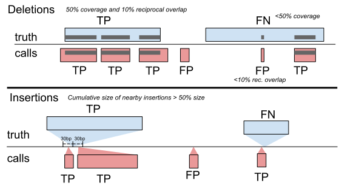

# sveval

Functions to compare a SV call sets against a truth set.

## Installation

```r
source('http://bioconductor.org/biocLite.R')
biocLite('jmonlong/sveval')
```

Or to install locally

```r
.libPaths('~/R/library/')
source('http://bioconductor.org/biocLite.R')
biocLite('jmonlong/sveval')
```

## Usage

```r
library(sveval)
svevalOl('calls.vcf', 'truth.vcf')
```

Outputs a data.frame with TP, FP, TN, precision, recall and F1 for all variants and for each SV type.

Some of the most important other parameters:

- `max.ins.dist=` maximum distance for insertions to be clustered. Default is 20.
- `min.cov=` the minimum coverage to be considered a match. Default is 0.5
- `min.del.rol=` minimum reciprocal overlap for deletions. Default is 0.1
- `min.size=` the minimum SV size to be considered. Default 0.
- `bed.regions=` If non-NULL, a GRanges object or path to a BED file (no headers) with regions of interest.
- `outfile=` the TSV file to output the results. If NULL (default), returns a data.frame.
- `ins.seq.comp=TRUE` compare sequence instead of insertion sizes. Default is *FALSE*.

See full list of parameters in the [manual](docs/sveval-manual.pdf) or by typing `?svevalOl` in R.

## Methods

- For deletions, at least 50% coverage and at least 10% reciprocal overlap.
- For insertions, size of nearby insertions (+- 20 bp) at least as much as 50% the size of insertion. Or comparing inserted sequence (sequence similarity instead of size).



## Docker

A docker image of R with this package installed is available [here](https://hub.docker.com/r/jmonlong/sveval/).
